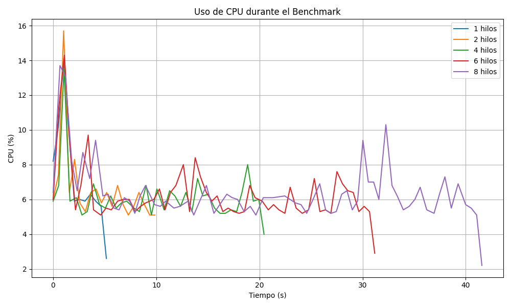
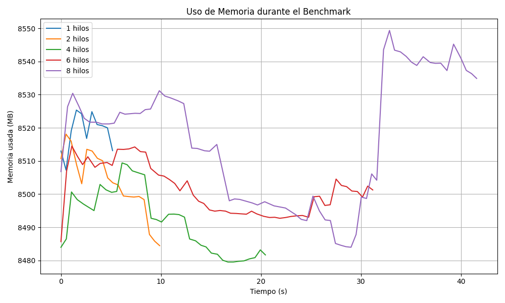

# PROYECTO-FINAL-TIC
# 🧪 Evaluación Comparativa de Rendimiento: Máquinas Virtuales vs Contenedores Docker

Este proyecto evalúa el rendimiento de contenedores Docker frente a máquinas virtuales VirtualBox, utilizando un conjunto de pruebas controladas y análisis comparativo detallado.

---

## 📘 ¿Qué son las Máquinas Virtuales y los Contenedores?

### 🖥️ Máquinas Virtuales (VM)

Una VM simula un hardware físico completo, permitiendo ejecutar un sistema operativo completo sobre un hipervisor. Proporcionan alto aislamiento, pero con mayor sobrecarga de recursos.

### 📦 Contenedores (Docker)

Los contenedores ejecutan procesos aislados que comparten el kernel del sistema operativo. Son más livianos, rápidos de iniciar y escalan eficientemente, aunque con menor aislamiento comparado a las VMs.

---

## 📁 Estructura del Proyecto

```
.
├── README.md
├── install.ipynb
├── img/
│   ├── cpu_usage.png
│   └── memory_usage.png
└── vm_vs_docker_benchmark/
    ├── notebooks/
    │   ├── comparar_resultados.ipynb
    │   └── vm_vs_docker.ipynb
    ├── results/
    │   ├── Resultados Docker/
    │   │   ├── run_1_threads.csv
    │   │   └── run_2_threads.csv
    │   └── Resultados VM/
    │       ├── run_1_threads.csv
    │       ├── run_2_threads.csv
    │       ├── run_4_threads.csv
    │       ├── run_6_threads.csv
    │       └── run_8_threads.csv
    └── scripts/
        ├── Dockerfile
        ├── run_benchmark.py
        ├── shared_code.c
        └── shared_code.so
```

---

## ⚙️ Requisitos del Proyecto

- Python 3.13.3
- Docker
- VirtualBox
- pip (gestor de paquetes Python)

---

## 🧰 Librerías necesarias

Instalación recomendada mediante pip:

```bash
pip install jupyter pandas matplotlib psutil
```

- **Jupyter**: Para visualizar y ejecutar notebooks interactivos.
- **Pandas**: Manipulación y análisis de estructuras de datos (CSV).
- **Matplotlib**: Gráficos y visualizaciones.
- **Psutil**: Obtención de estadísticas de uso del sistema.

---

## 📏 Métricas Medidas

- Uso de CPU (% bajo carga y reposo)
- Uso de RAM
- Tiempo de ejecución de tareas computacionales
- Tiempo de arranque de contenedor/VM
- Tiempo de despliegue de aplicación de prueba
- Comparativa multi-thread (1, 2, 4, 6, 8 hilos)
- Rendimiento de código en C compartido entre entornos

---

## 🧪 Entorno de Pruebas

| Elemento         | Detalle                                 |
|------------------|------------------------------------------|
| Plataforma host  | Windows 11                      |
| VM               | VirtualBox con Ubuntu minimal (2 vCPU)  |
| Contenedor       | Docker usando imagen `python:3.13`      |
| Código benchmark | Script en C compilado, ejecutado vía Python (`run_benchmark.py`) |
| Pruebas          | 1, 2, 4, 6, 8 hilos con repetición       |

---

## 🔍 ¿En qué consisten las pruebas de rendimiento?

Este proyecto evalúa comparativamente cómo se comportan las **máquinas virtuales (VM)** y los **contenedores Docker** al ejecutar tareas computacionalmente intensivas. Las pruebas realizadas miden:

- 🔧 **Uso de CPU**  
- 🧠 **Uso de Memoria RAM**  
- ⏱️ **Tiempo de ejecución de tareas multihilo**

Para esto, se ejecutan programas en C que realizan cálculos pesados durante un tiempo determinado, simulando escenarios reales donde el procesamiento es crítico.

---

## 🧵 ¿Qué son los hilos y por qué se usan?

Las pruebas se ejecutan con distintas cantidades de **hilos (threads)**: 1, 2, 4, 6 y 8. Un hilo representa una línea de ejecución paralela, y su uso permite:

- Aprovechar **múltiples núcleos de CPU**.
- Ejecutar tareas más rápido gracias al **paralelismo**.
- Medir cómo **escala el entorno** cuando aumentamos la carga.

| Nº de Hilos | Significado |
|-------------|-------------|
| 1 hilo      | Ejecución secuencial (una sola tarea). |
| 2 hilos     | Ejecución paralela en dos núcleos. |
| 4-8 hilos   | Tareas distribuidas en varios núcleos disponibles. |

Esto es especialmente relevante para evaluar **el rendimiento en sistemas multihilo**, algo común en servidores, análisis de datos, simulaciones científicas, etc.

---

## 📈 Visualización del Rendimiento

A continuación se muestran gráficos que comparan el uso de CPU y RAM durante las pruebas en función del número de hilos. Estas gráficas permiten observar:

- Cómo escala cada entorno (Docker vs VM) al aumentar la carga.
- Qué entorno gestiona mejor el paralelismo.
- El impacto en el consumo de recursos.

## 📊 Análisis de Resultados

A continuación se muestran los gráficos generados durante las pruebas de benchmark, midiendo el uso de CPU y memoria con diferentes cantidades de hilos:

### 🧠 Uso de CPU durante el Benchmark



> Se observa que al aumentar el número de hilos, el uso de CPU presenta picos más prolongados, especialmente con 6 y 8 hilos. Sin embargo, el uso medio tiende a estabilizarse en torno al 6%, mostrando eficiencia en la distribución de la carga.

---

### 💾 Uso de Memoria durante el Benchmark



> El uso de memoria permanece estable en torno a los 8500 MB, con ligeras variaciones según el número de hilos. Docker muestra un uso más constante, mientras que en VM hay fluctuaciones más evidentes, especialmente con 8 hilos.

---

## 📈 Comparativa y Análisis (Notebooks)

En los notebooks `comparar_resultados.ipynb` y `vm_vs_docker.ipynb` se incluye:

- Gráficos comparativos del rendimiento entre VM y Docker.
- Evaluación visual de escalabilidad por hilos.
- Comentarios detallados sobre el comportamiento de cada entorno.
- Conclusiones respaldadas por datos medidos.

Los gráficos permiten apreciar diferencias en consumo de CPU, RAM y tiempo de ejecución por número de hilos.

---

## ✅ Conclusiones

| Criterio                    | Docker                   | VirtualBox                |
|-----------------------------|--------------------------|---------------------------|
| Tiempo de arranque          | ✅ Rápido (~1s)           | ❌ Lento (~30s)           |
| Consumo de recursos         | ✅ Bajo                   | ❌ Alto                   |
| Aislamiento                 | ❌ Parcial (kernel host)  | ✅ Completo               |
| Portabilidad                | ✅ Muy alta               | ⚠️ Moderada               |
| Rendimiento con multithread | ✅ Escala eficientemente  | ⚠️ Menor eficiencia        |

Docker se muestra como una alternativa ágil y eficiente para despliegue rápido y pruebas ligeras, mientras que las VMs siguen siendo necesarias en contextos donde el aislamiento completo es crítico.

---

## 📚 Referencias

- Docker: https://docs.docker.com/
- VirtualBox: https://www.virtualbox.org/wiki/Documentation
- Python: https://www.python.org/doc/
- Notebooks comparativos: `notebooks/`
- Resultados en CSV: `results/`
